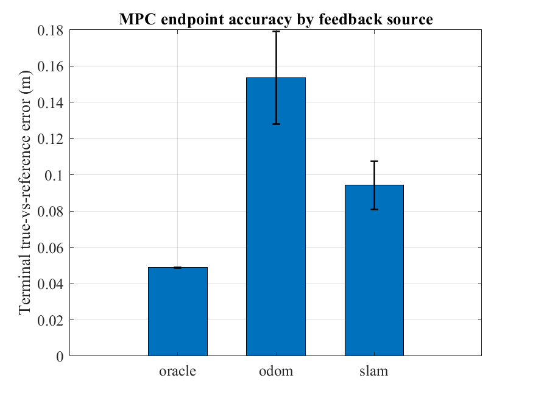
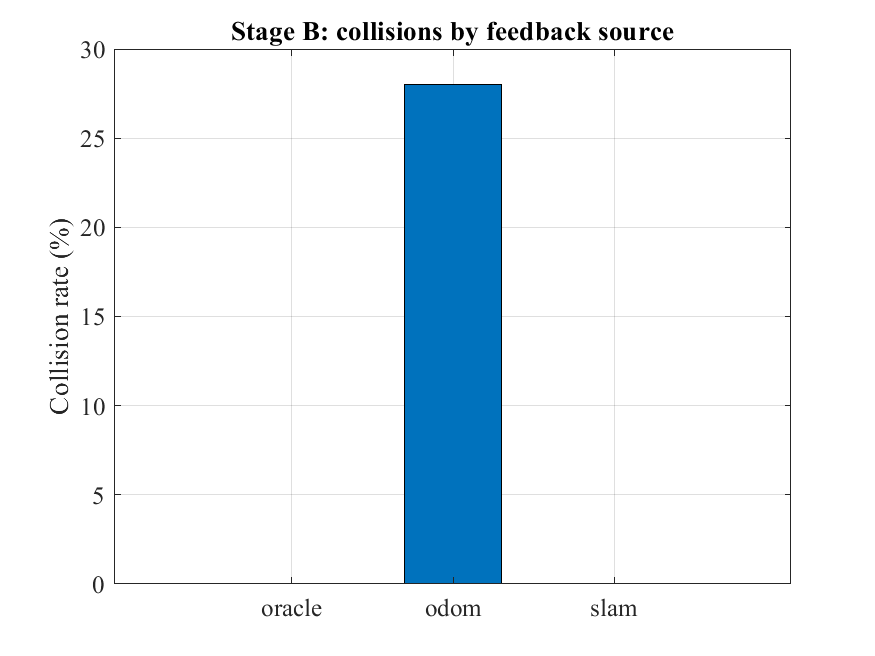
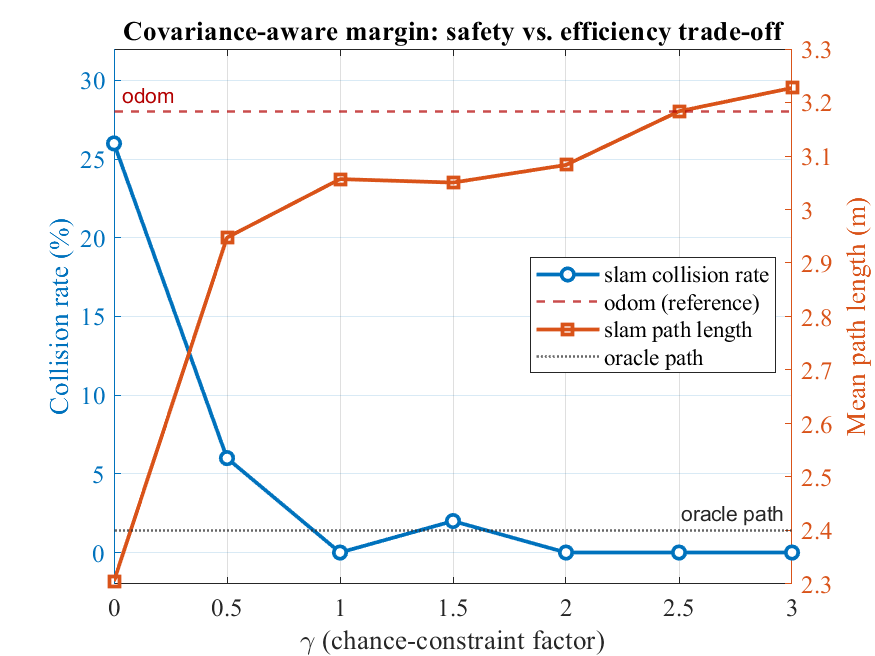
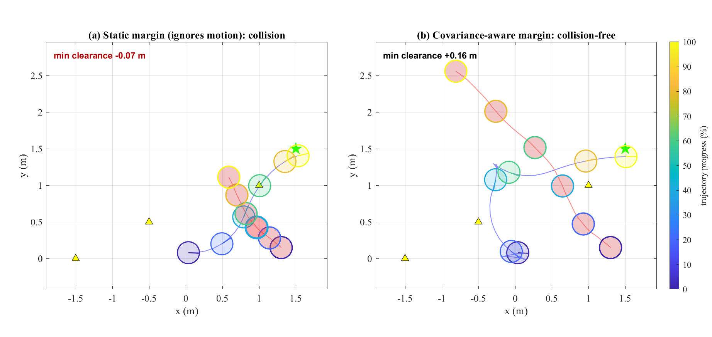
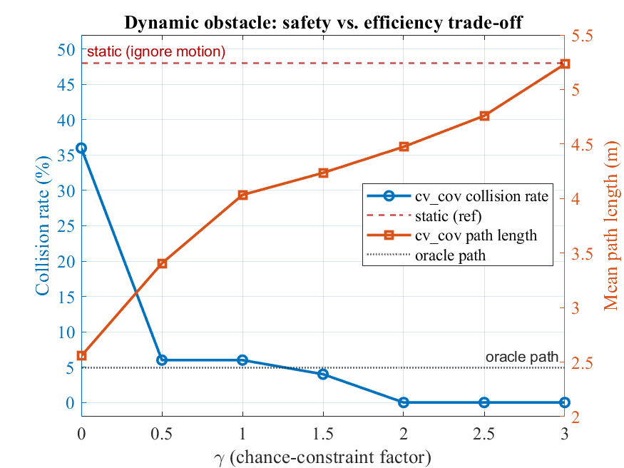

# Uncertainty-Aware Closed-Loop MPC with EKF-SLAM

MATLAB/CasADi code for the paper *"Uncertainty-Aware Closed-Loop Model Predictive
Control with EKF-SLAM for Safe Navigation of Nonholonomic Mobile Robots."*

A differential-drive (unicycle) robot is controlled by a constrained nonlinear MPC
(NMPC) that is fed pose estimates from an EKF-SLAM filter. Beyond the usual
certainty-equivalence coupling, the **EKF-SLAM covariance is fed back into the
controller** to size obstacle keep-out constraints online: the keep-out radius grows
when the robot is uncertain and tightens when it is confident (a chance constraint).

## Key results (Monte-Carlo, 50 trials)

- **Tracking:** closing the loop with EKF-SLAM cuts terminal tracking error ~39% vs.
  dead-reckoning (odometry), approaching the ideal-state (oracle) bound.
- **Safety:** with a *fixed* obstacle margin, both SLAM and odometry collide in ~26–28%
  of trials. The **covariance-aware margin eliminates SLAM collisions (0%)** at no
  accuracy cost — an outcome neither a fixed margin nor odometry can match.
- **Dynamic obstacle:** a moving obstacle is tracked by a constant-velocity EKF; the
  margin is inflated by the *combined* robot-localization and obstacle-prediction
  covariance. This drives collisions to **0%** where ignoring the motion (48%) or a
  fixed margin (36%) fail.
- **Real-time:** ~4–7 ms per control step (p95 ≤ 15 ms), an order-of-magnitude margin;
  the EKF and the covariance term are negligible.

| Free-space tracking | Stage A (fixed) vs Stage B (cov-aware) | γ sweep (safety–efficiency) |
|---|---|---|
|  |  |  |

### Dynamic (moving) obstacle

Same trial, same obstacle motion — only the avoidance strategy differs. Under a fixed
margin the robot and obstacle disks overlap (collision); the covariance-aware margin
detours and stays clear:



| Dynamic γ sweep | Animations |
|---|---|
|  | [safe run (cv_cov)](figures/dyn_anim_cvcov_safe.gif) · [collision run (static)](figures/dyn_anim_static_collision.gif) |

## Repository structure

```
non-obstacle/      Free-space point-stabilization study (oracle / odom / slam)
obstacle-stage-a/  Static obstacle avoidance with a fixed safety margin
obstacle-stage-b/  Static obstacle avoidance with the covariance-aware chance constraint
gamma-sweep/       Static safety vs. efficiency trade-off over the chance factor gamma
dynamic-obstacle/  Moving obstacle: CV-EKF tracker + time-varying chance constraint
legacy/            Original single-run prototype (kept for reference)
figures/           Figures used in the README / paper
```

Each experiment folder is self-contained (it carries its own copy of `mc_ekf_step.m`).

| Run this | Produces |
|---|---|
| `non-obstacle/run_montecarlo.m` | `mc_results.mat`, tracking-error + trajectory figures |
| `obstacle-stage-a/run_montecarlo_obs.m` | collision-rate + trajectory figures (fixed margin) |
| `obstacle-stage-b/run_montecarlo_obs.m` | same, with `cfg.cov_aware = true` |
| `gamma-sweep/run_gamma_sweep.m` | `gamma_sweep.mat`, trade-off figure |
| `dynamic-obstacle/run_montecarlo_dyn.m` | 4-strategy collision study (oracle/static/cv_fixed/cv_cov) |
| `dynamic-obstacle/run_gamma_sweep_dyn.m` | dynamic safety–efficiency trade-off |
| `dynamic-obstacle/fig_side_by_side.m`, `make_dyn_media.m` | paper figure + animations |
| `*/time_perf*.m` | per-step timing benchmark |

## Requirements

- **MATLAB** (developed on a recent release; uses `wrapToPi`/`wrapTo2Pi`).
- **CasADi** for MATLAB, v3.5.5 (<https://web.casadi.org/>).

Each runnable script begins with an `addpath(...)` to CasADi — **edit that path** to
point at your CasADi install, e.g.:

```matlab
addpath('C:\path\to\casadi-windows-matlabR2016a-v3.5.5');
import casadi.*
```

Then, in MATLAB, `cd` into an experiment folder and run the corresponding
`run_*` script.

## Method summary

- **Unicycle model** with a range–bearing measurement model.
- **EKF-SLAM** with exact velocity-motion prediction and a sequential per-landmark
  measurement update; landmarks are surveyed (known prior, refined online).
- **NMPC** via multiple-shooting transcription, solved with CasADi + IPOPT, with
  actuator-limit and disk obstacle-avoidance constraints.
- **Covariance-aware chance constraint:** the obstacle keep-out margin is
  `delta = delta0 + gamma * sqrt(lambda_max(Sigma_xy))`, where `Sigma_xy` is the
  EKF-SLAM position-covariance block.
- **Dynamic obstacle:** a constant-velocity EKF (`cv_tracker_step.m`) tracks the
  moving obstacle; the horizon constraint uses the predicted track, and the margin
  becomes `delta_k = delta0 + gamma * sqrt(lambda_max(P_xy + Sigma_obs,k))`, combining
  robot-localization and obstacle-prediction uncertainty (the latter growing with
  look-ahead). A soft slack keeps the QP feasible in tight encounters.

## Notation (code &harr; paper)

The code keeps its own self-consistent variable names; they map to the paper symbols
as follows (paper notation follows the standard Kalman convention: **Q** = process,
**R** = measurement):

| Code | Paper | Meaning |
|---|---|---|
| `X` | `x_hat` | EKF-SLAM state estimate (augmented) |
| `Sigma` | `P` | state covariance |
| `P.M` | `Q_u` | input/control-noise covariance `diag(sigma_v^2, sigma_omega^2)` |
| `P.Q` | `R` | measurement-noise covariance `diag(sigma_d^2, sigma_phi^2)` |
| `P.L` | `M` | number of landmarks |
| `P.dt`, `T` | `dt` | sampling period |
| `cfg.lm` | `(l_x,i, l_y,i)` | surveyed landmark coordinates |
| `cfg.xs` | `x*` | reference posture |
| `cfg.gamma` | `gamma` | chance-constraint factor |
| `cfg.safe_buffer` | `delta_0` | fixed keep-out buffer |
| `Q`, `R` (in `run_*`/`mc_build_*`) | `W_x`, `W_u` | MPC stage-cost weights |
| `N` | `N` | MPC prediction horizon |

Note: the parameter struct `P` in `mc_ekf_step.m` is **not** the covariance — the
covariance is `Sigma` (paper `P`).

## Attribution

The MPC/CasADi single-shooting and obstacle-avoidance formulations build on the
open-source NMPC-for-mobile-robots tutorial by M. W. Mehrez
(*Stabilizing NMPC of wheeled mobile robots using open-source real-time software*,
ICAR 2013; and the associated MATLAB workshop materials).

## Citation

If you use this code, please cite the accompanying paper (details to be added upon
publication).

## License

MIT — see [LICENSE](LICENSE).

## Contact

Dun Liu — leoliudun0818@gmail.com
